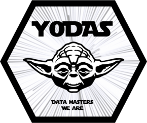

# YodasLib
World Data League 2022 team YODAS - Python package




# YODAS Custom Python Package (YodasLib)

This Python package includes a module for wildlife dark corridors optimization, one of the outputs of the YODAS team in 2022 edition of WDL.

## YODAS Application 

[Get installer here](https://drive.google.com/drive/folders/1Tlgi7uc7n5IB7NKZArXi6nPkIJvfcZLv?usp=sharing)

YodasLib is used in the custom application developed by YODAS for the WDL 2022 finals. This application allows the user to customize and visualize in real time the optimization of wildlife dark corridors and is flexibility to any animal and city. 

## Installation

The package was only tested for Python 3, so there is no guarantee that it works with Python 2.


<details>
    <summary><b>[OPTIONAL] Create a virtual environment before the installation</b></summary>

  
##### Windows
1 - Go to the project folder and open a Command Prompt

2 - Run the following command to create the virtual environment
```bash 
virtualenv <name of the virtual environment> 
```

3 - Activate the virtual environment with the following command (always in the creation folder)
```bash 
<name of virtual environment>\Scripts\activate.bat
```

##### Ubuntu
1 - Enter as root with the following command
```bash 
sudo -i
```  

2 - Go to the project folder and run the following command to create the virtual environment
```bash 
python3 -m venv <name of virtual environment>
```

3 - Activate the virtual environment with the following command (always in the creation folder)
```bash 
source <name of virtual environment>/bin/activate
```
</details>

### Install the package with pip in your personal computer
```bash 
pip install git+https://github.com/joao-afonso-pereira/YodasLib.git
```

### Usage example
```python 
import YODAS.DarkCorridors import LightManager

# Necessary data:
#  - City grid with the following columns: zone, geometry, animal_score, human_score, contains_cluster, nearest_cluster, cluster_score
#  - GeoJSON with city map
#  - CSV with city's street lights

grid_df = pd.read_csv('grid.csv') # City grid
grid_df.geometry = gpd.GeoSeries.from_wkt(grid_df.geometry)
grid_df = gpd.GeoDataFrame(grid_df, geometry='geometry')

city_map = 'https://martinjc.github.io/UK-GeoJSON/json/eng/wpc_by_lad/topo_E06000023.json' # Path to geojson with city map
street_lights = 'streetlights_2022.csv' # Path to CSV with street lights

manager = LightManager(grid_df, city_map, street_lights)
    
clusters = manager.plot_clusters()
manager.load('cost_matrix.csv')
paths = manager.find_cluster_paths()
corridors = manager.create_dark_corridors()
new_lights = manager.update_lighting()
```
